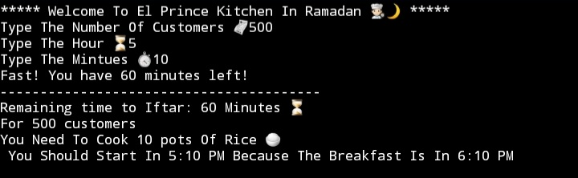
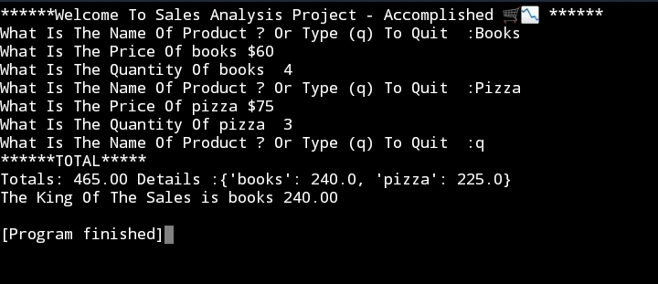
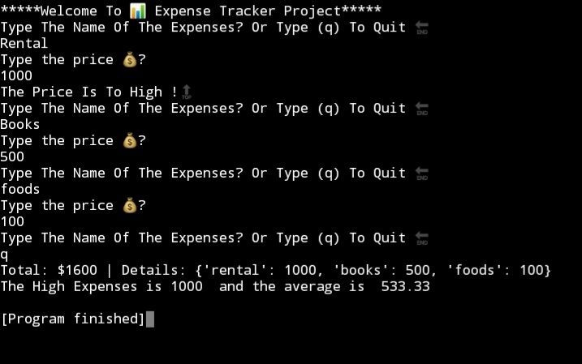
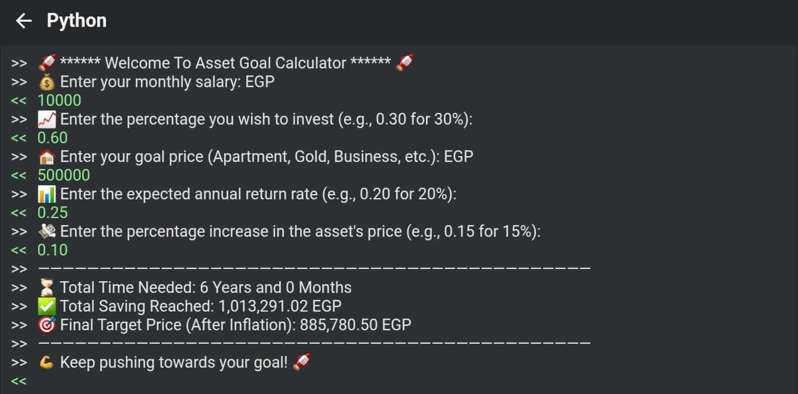

 📊 My First Python Projects - رحلتي الأولى مع بايثون

This repository contains my early projects in Python, developed entirely on a **mobile device** while I work towards getting my first laptop.
هذا المستودع يحتوي على مشاريعي الأولى بلغة بايثون، قمت ببرمجتها بالكامل باستخدام **الهاتف المحمول** خلال رحلتي لتعلم تحليل البيانات.

---

## 🚀 Projects | المشاريع

### 1️⃣ El Prince Kitchen System (`elprince_kitchen_system.py`) 👨‍🍳
* **English:** A smart system I created during my work at "El Prince" restaurant. It calculates the number of rice pots needed based on customer count and tracks the remaining time until Iftar.
* **عربي:** نظام ذكي صممته أثناء عملي في مطعم البرنس. يقوم بحساب عدد حلل الرز المطلوبة بناءً على عدد الزبائن، ومتابعة الوقت المتبقي للإفطار بدقة.

### 2️⃣ Sales Analysis Tool (`sales_analysis.py`) 📈
* **English:** A script to calculate total sales and identify the top-selling product ("The King of Sales").
* **عربي:** برنامج لتحليل المبيعات، يحسب الإجمالي ويحدد المنتج الأكثر مبيعاً.

### 3️⃣ Expense Tracker (`expense_tracker.py`) 💰
* **English:** A tool to monitor daily expenses with a high-price alert system.
* **عربي:** أداة لمتابعة المصاريف اليومية مع نظام تنبيه للمصاريف العالية.
* ### 4️⃣ Asset Goal & Investment Calculator (`asset_calculator.py`)
* **English:** A financial tool to estimate the time required to reach a specific financial goal (like buying an apartment or gold), taking into account investment returns and annual inflation.
* **عربي:** أداة مالية لحساب الوقت المطلوب للوصول لهدف مالي معين (مثل شراء شقة أو ذهب)، مع مراعاة العائد على الاستثمار ونسبة التضخم السنوي.

---

## 🖼️ Preview | معاينة النتائج

### El Prince Kitchen System:

### Sales & Expenses:

### Asset Goal Calculator: 
 

## 🛠️ Tools | الأدوات
* **Language:** Python 3 
* **Environment:** Mobile (Pydroid 3) & Laptob
* **Current Goal:** Learning Data Analysis & Improving my English.
