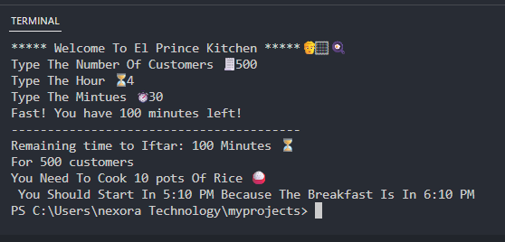
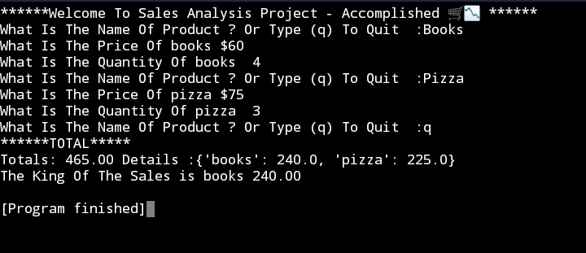
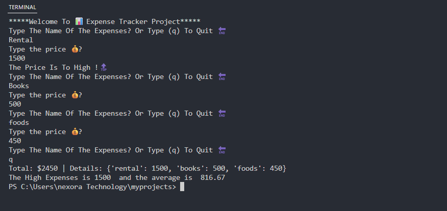
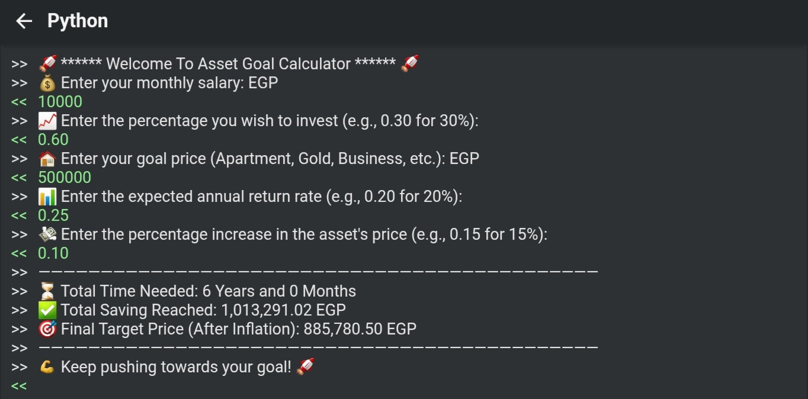
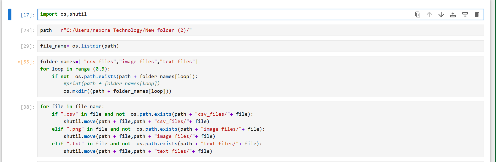
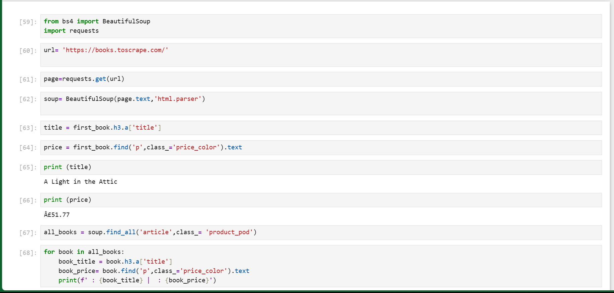
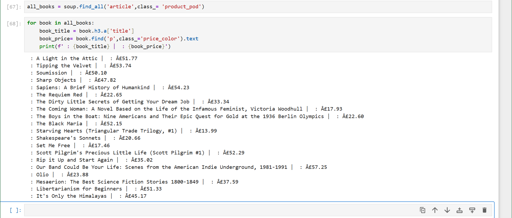
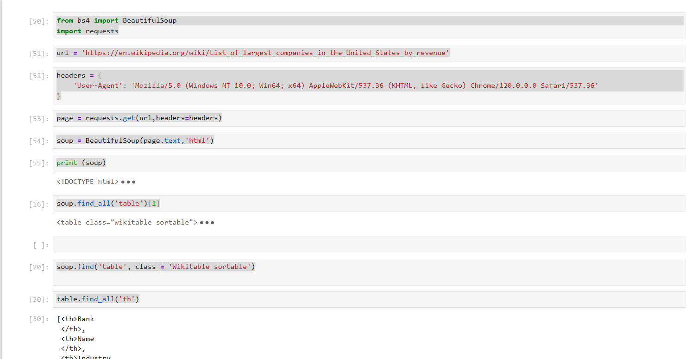
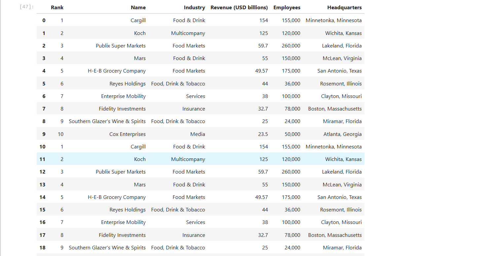

# 📊 My Python Data Analysis & Automation Projects

This repository serves as a showcase for my initial journey into Python programming. Every project here was conceptualized, coded, and tested entirely on a **mobile device** using Pydroid 3, reflecting my deep commitment to learning despite hardware limitations. These projects demonstrate my progression from basic scripting to creating practical tools that solve real-world problems.

---

## 🚀 Projects Portfolio

### 1️⃣ El Prince Kitchen Management System (`elprince_kitchen_system.py`) 👨‍🍳
El Prince Kitchen Management System
​Overview
A high-efficiency logistical solution engineered for "El Prince" restaurant to optimize kitchen operations during high-pressure scenarios, specifically tailored for peak demand hours during Ramadan. This Python-based application streamlines resource allocation and time management to ensure seamless service delivery.
​Core Capabilities & Value Proposition
​Dynamic Inventory Optimization: Implements an algorithmic approach to calculate precise inventory requirements (e.g., rice pot units) based on real-time customer volume inputs, effectively minimizing food waste and overhead.
​Operational Intelligence: Features a sophisticated countdown and scheduling integration that synchronizes kitchen tasks with the Iftar timeline.
​Performance Impact: Provides actionable insights by automatically calculating the optimal start time for meal preparation, ensuring that service remains consistent and on-schedule despite extreme demand fluctuations.

### El Prince Kitchen System:

### 2️⃣ Sales Analysis & Optimization Tool (`sales_analysis.py`) 📈
Sales Analysis & Optimization Tool
​Overview
An automated data-processing utility designed to replace manual sales tracking with a streamlined, analytical workflow. This tool transforms raw transaction inputs into meaningful business intelligence, allowing for rapid performance assessment and data-driven decision-making.
​Core Capabilities & Value Proposition
​Automated Revenue Analytics: Processes product-level input to generate total revenue metrics instantaneously, reducing manual calculation errors.
​Performance Metrics & Trend Identification: Features a "King of Sales" algorithm that automatically identifies high-performing products, providing immediate insights into inventory demand and profit drivers.
​Decision Support: Delivers summarized output that facilitates smarter inventory management and strategic stocking decisions, helping businesses focus on high-value product lines.

### 3️⃣ Personal Expense Tracker (`expense_tracker.py`) 💰
* **Problem:** Lack of visibility into daily spending habits and difficulty in managing personal budgets.
* **Solution:** An automated financial monitoring tool to enforce fiscal discipline.
* **Key Functionality:** Users can input daily expenses, which are tracked against a budget. The script includes an automated "High-Price Alert" system that warns users when spending exceeds specific, predefined thresholds, helping users maintain better control over their finances.

### 4️⃣ Asset Goal & Investment Calculator (`asset_calculator.py`) 🏦
* **Problem:** Uncertainty regarding financial timelines for long-term investments like purchasing property or gold.
* **Solution:** A complex financial modeling tool that simulates future growth.
* **Key Functionality:** This script calculates the exact time required to reach financial targets by factoring in compounding investment returns and annual inflation rates. It helps in planning for major life purchases by providing a realistic projection of capital accumulation over time.

### Asset Goal Calculator: 
 

5️⃣ Automated File Organizer (`file_organizer.py`)

Automated File Organizer
​An automated Python script designed to clean, sort, and manage cluttered directories by filtering and moving files into specific folders based on their extensions.
​As a Data Analyst, keeping data environments structured is essential. This project automates the initial Data Triage and file organization process, saving time and establishing a reliable pipeline before the data extraction and transformation (ETL) phases.
​🧠 Logic & Workflow
​The script executes through three logical phases:
​Directory Scanning: It reads the specified path and gathers a comprehensive list of all contained files using the os module.
​Directory Creation: It checks for the existence of target folders (csv_files, image_files, text_files). If they do not exist, it dynamically creates them.
​File Sorting & Routing: It loops through each file, identifies its format (e.g., .csv, .png, .txt), and safely transfers it to its designated folder utilizing the shutil library.
​🚀 Key Features
​Dynamic Folder Checking: Prevents script crashes by verifying folder existence before creation.
​Automated File Routing: Uses conditional logic to sort files instantly.
​Robust Path Handling: Implements os.path.join to ensure cross-platform compatibility and avoid path string syntax errors.
​Streamlined Efficiency: Eliminates manual file sorting, allowing more focus on core data analysis tasks.

### file organizer :
 

________________________________________________________________-

6️⃣ Web Scraping and Data Extraction Project:
Books to Scrape(`web_scraping.py)

​Project Overview

​This project focuses on automated data extraction and collection from the web using Python. The primary objective is to scrape a multi-page e-commerce website to extract book details, including their full titles and prices. Instead of relying on pre-existing static datasets, this project demonstrates the ability to gather live, raw data from the web, which is a foundational step in any data analysis workflow.

​Core Features
​Automated HTTP requests to retrieve website source code.
​Parsing HTML structures to locate and isolate specific data points.
​Extraction of nested attributes and text elements from web pages.
​Data structuring capabilities for future analysis.
​Technologies Used
​Python: The core programming language.

​Jupyter Notebook: The development environment used for writing and testing the code interactively.
​BeautifulSoup4 (bs4): For parsing HTML documents and navigating the DOM tree structure.
​Requests: For handling HTTP requests to fetch webpage data.
​Technical Challenges and Solutions
​1. Scope and Variable Overwriting in Loops
​Challenge: An initial logical error occurred when separating the iteration logic from the extraction output across different notebook cells. The printing function was placed outside the execution block of the loop, causing the program to output only the final record of the scraped dataset due to continuous variable overwriting.
​Solution: Restructured the notebook execution sequence by encapsulating both the data parsing and the output printing within a single unified for loop block, maintaining strict indentation integrity.

​2. Python Reserved Keyword Conflicts
​Challenge: A SyntaxError was encountered when trying to filter HTML elements by their CSS class names using the standard class keyword, which is reserved for object-oriented programming in native Python.
​Solution: Resolved the syntax conflict by utilizing the BeautifulSoup-specific class_ argument, allowing the script to target specific HTML element classes smoothly.
​

3. Character Encoding Issues
​Challenge: The extracted price data contained unexpected corrupted characters (e.g., £) preceding the currency symbol. This happened due to a mismatch between the website's character encoding format and the default parsing interpretation.
​Solution: Identified the encoding discrepancy and introduced proper text decoding mechanisms to clean the textual output, ensuring a standardized and accurate dataset.

#### web scraping :

------------

# 7️⃣ US Companies Web Scraper

A robust Python script designed to extract, clean, and structure data regarding the largest companies in the United States by revenue from Wikipedia. This project demonstrates end-to-end data collection (Web Scraping), handling HTTP request headers, data cleaning, and structured storage using Pandas.

## Features
* **Request Simulation:** Implements custom User-Agent headers within the Requests library to bypass automated bot detection and ensure stable connection with the server.
* **HTML Parsing:** Utilizes BeautifulSoup to navigate the HTML DOM structure and precisely target the desired data tables.
* **Data Cleaning:** Trims whitespace and handles newline characters dynamically using text manipulation methods.
* **Structured Export:** Processes the extracted rows into a Pandas DataFrame and exports the final dataset into a clean CSV file.

## Tech Stack
* **Language:** Python
* **Libraries:** Requests, BeautifulSoup4, Pandas
* **Environment:** Jupyter Notebook

## Code Workflow
1. **HTTP Request:** Sent a GET request to the Wikipedia URL with a browser-impersonating User-Agent header.
2. **Parsing:** Parsed the raw HTML content using the BeautifulSoup HTML parser.
3. **Extraction:** Targeted the specific table attributes (`wikitable sortable`) to fetch table headers (`<th>`) and table rows (`<tr>`).
4. **Data Structuring:** Iterated through the row cells (`<td>`), cleaned the text formatting, and dynamically appended them into a Pandas DataFrame.
5. **Storage:** Saved the structured dataset locally as a CSV file while disabling the default DataFrame index column.

## Output
The project generates a structured `companies.csv` file containing the following features:
* Rank
* Name
* Industry
* Revenue (USD billions)
* Employees

---

## 🛠️ Technical Foundation
* **Programming Language:** Python 3
* **Primary Environment:** Pydroid 3 (Mobile Development) & Laptop (Post-Development)
* **Core Skills:** Algorithmic logic, data input/output handling, automated conditional alerts, and financial modeling.
* **Professional Goal:** To transition my analytical mindset into a full-time Data Analysis career, leveraging my ability to build automated solutions from scratch.
