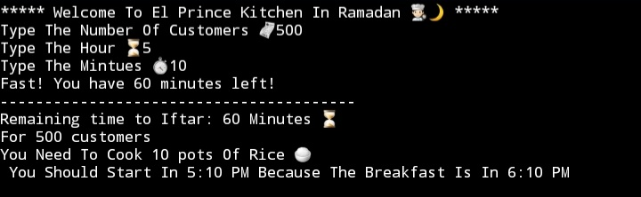
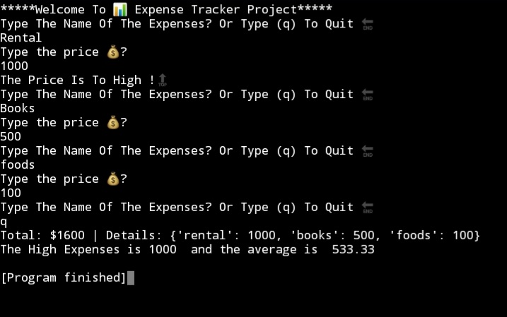

# 📊 My Python Data Analysis & Automation Projects

This repository serves as a showcase for my initial journey into Python programming. Every project here was conceptualized, coded, and tested entirely on a **mobile device** using Pydroid 3, reflecting my deep commitment to learning despite hardware limitations. These projects demonstrate my progression from basic scripting to creating practical tools that solve real-world problems.

---

## 🚀 Projects Portfolio

### 1️⃣ El Prince Kitchen Management System (`elprince_kitchen_system.py`) 👨‍🍳
* **Problem:** Managing inventory efficiency and timing during high-pressure shifts in a busy restaurant environment.
* **Solution:** A smart logistics system I developed for "El Prince" restaurant. 
* **Key Functionality:** The script dynamically calculates the exact number of rice pots needed based on daily customer volume, reducing food waste. Additionally, it integrates a countdown timer to monitor the time remaining until Iftar, ensuring smooth operations during peak service hours.

### 2️⃣ Sales Analysis & Optimization Tool (`sales_analysis.py`) 📈
* **Problem:** Difficulty in identifying high-value products and tracking overall business performance manually.
* **Solution:** A robust data processing script that ingests sales data to generate actionable business intelligence.
* **Key Functionality:** It calculates total revenue, identifies the "King of Sales" (top-selling product), and provides a breakdown of performance metrics, enabling data-driven decisions for inventory stocking.

### 3️⃣ Personal Expense Tracker (`expense_tracker.py`) 💰
* **Problem:** Lack of visibility into daily spending habits and difficulty in managing personal budgets.
* **Solution:** An automated financial monitoring tool to enforce fiscal discipline.
* **Key Functionality:** Users can input daily expenses, which are tracked against a budget. The script includes an automated "High-Price Alert" system that warns users when spending exceeds specific, predefined thresholds, helping users maintain better control over their finances.

### 4️⃣ Asset Goal & Investment Calculator (`asset_calculator.py`) 🏦
* **Problem:** Uncertainty regarding financial timelines for long-term investments like purchasing property or gold.
* **Solution:** A complex financial modeling tool that simulates future growth.
* **Key Functionality:** This script calculates the exact time required to reach financial targets by factoring in compounding investment returns and annual inflation rates. It helps in planning for major life purchases by providing a realistic projection of capital accumulation over time.

5️⃣ Automated File Organizer (`file_organizer.py`)

An automated Python script designed to clean, sort, and manage cluttered directories by filtering and moving files into specific folders based on their extensions.
​As a Data Analyst, keeping data environments structured is essential. This project automates the initial Data Triage and file organization process, saving time and establishing a reliable pipeline before the data extraction and transformation (ETL) phases.
​🧠 Logic & Workflow
​The script executes through three logical phases:
​Directory Scanning: It reads the specified path and gathers a comprehensive list of all contained files using the os module.
​Directory Creation: It checks for the existence of target folders (csv_files, image_files, text_files). If they do not exist, it dynamically creates them.
​File Sorting & Routing: It loops through each file, identifies its format (e.g., .csv, .png, .txt), and safely transfers it to its designated folder utilizing the shutil library.
​🚀 Key Features
​Dynamic Folder Checking: Prevents script crashes by verifying folder existence before creation.
​Automated File Routing: Uses conditional logic to sort files instantly.
​Robust Path Handling: Implements os.path.join to ensure cross-platform compatibility and avoid path string syntax errors.
​Streamlined Efficiency: Eliminates manual file sorting, allowing more focus on core data analysis tasks.
​🛠️ Built With
​Python 3
​OS Module (Built-in file system management)
​Shutil Module (High-level file operations)
---

## 🖼️ Results & Preview

### El Prince Kitchen System:

### Sales & Expenses:

### Asset Goal Calculator: 
 

---

## 🛠️ Technical Foundation
* **Programming Language:** Python 3
* **Primary Environment:** Pydroid 3 (Mobile Development) & Laptop (Post-Development)
* **Core Skills:** Algorithmic logic, data input/output handling, automated conditional alerts, and financial modeling.
* **Professional Goal:** To transition my analytical mindset into a full-time Data Analysis career, leveraging my ability to build automated solutions from scratch.
